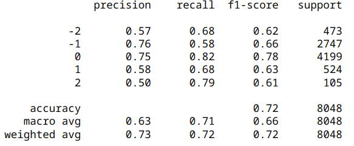

# NLP-project
 Sentiment analysis 
 
 Data: posts from VK (vk.com)
 
 ## Preprocessing
 - Clear text from URL's, punctuation, etc
 - Lower casing
 - Tokennization
 - Deleting stop-words
 - Lemmatization
 - Upsampling
 
 ## Embedings
 - Doc2Vec
 - Navec
 
 ## Model that were used
 - kNN
 - Random Forest
 - LSTM
 - XGBoost
 - Adaboost
 
 ## Best model
 Random Forest
 
 test data results (the test data has not been changed):
 
 
 
